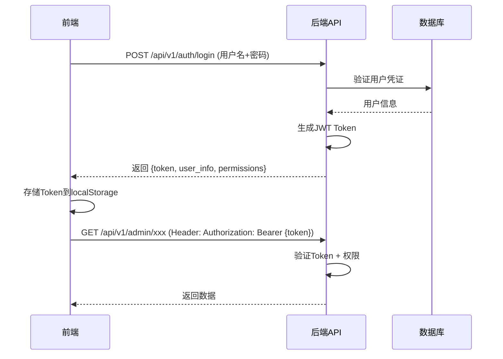

# 企业微信群管理系统 - 前端开发计划

> 文档创建时间：2025-10-27  
> 后端版本：v5.0.0（统一架构）  
> 规划目标：构建现代化、易用的管理后台系统

---

## 📋 目录

1. [项目概述](#1-项目概述)
2. [技术选型](#2-技术选型)
3. [API鉴权方案](#3-api鉴权方案)
4. [功能模块规划](#4-功能模块规划)
5. [开发阶段划分](#5-开发阶段划分)
6. [详细页面设计](#6-详细页面设计)
7. [开发规范](#7-开发规范)
8. [部署方案](#8-部署方案)

---

## 1. 项目概述

### 1.1 系统背景

企业微信群管理系统后端采用统一架构设计，提供了完整的群组管理、用户身份识别、规则配置、数据分析等功能。现需要开发配套的前端管理系统，为管理员提供可视化的操作界面。

### 1.2 核心目标

- ✅ **易用性**：简洁直观的UI设计，降低学习成本
- ✅ **高效性**：快速响应，优化的数据加载和展示
- ✅ **安全性**：完善的权限控制和数据保护
- ✅ **可维护性**：清晰的代码结构，易于扩展
- ✅ **响应式**：支持PC端和移动端访问

### 1.3 用户角色

| 角色 | 权限范围 | 主要功能 |
|------|----------|----------|
| **超级管理员** | 全部功能 | 系统配置、用户管理、数据导出 |
| **业务线管理员** | 所属业务线 | 群组管理、规则配置、数据查看 |
| **分析员** | 只读权限 | 数据分析、报表查看 |
| **运营人员** | 部分编辑 | 规则配置、短链接管理 |

---

## 2. 技术选型

### 2.1 核心技术栈

#### 前端框架 - **Vue 3 + TypeScript**

**选型理由**：
- ✅ Vue 3 Composition API，代码组织更清晰
- ✅ TypeScript 提供类型安全，降低bug率
- ✅ 丰富的生态系统和组件库
- ✅ 优秀的开发体验和学习曲线

```json
{
  "vue": "^3.3.0",
  "typescript": "^5.0.0",
  "vite": "^5.0.0"
}
```

#### UI组件库 - **Element Plus**

**选型理由**：
- ✅ Vue 3 原生支持，组件丰富
- ✅ 中后台管理系统最佳实践
- ✅ 完善的文档和社区支持
- ✅ 支持主题定制

```json
{
  "element-plus": "^2.4.0",
  "@element-plus/icons-vue": "^2.1.0"
}
```

#### 状态管理 - **Pinia**

**选型理由**：
- ✅ Vue 3 官方推荐
- ✅ TypeScript 友好
- ✅ 轻量、简洁的API
- ✅ DevTools支持

```json
{
  "pinia": "^2.1.0"
}
```

#### 路由管理 - **Vue Router 4**

```json
{
  "vue-router": "^4.2.0"
}
```

#### HTTP客户端 - **Axios**

```json
{
  "axios": "^1.6.0"
}
```

#### 数据可视化 - **ECharts**

**用于数据分析看板**：
```json
{
  "echarts": "^5.4.0",
  "vue-echarts": "^6.6.0"
}
```

### 2.2 辅助工具

| 工具 | 版本 | 用途 |
|------|------|------|
| **VueUse** | ^10.0.0 | Vue Composition 工具集 |
| **Day.js** | ^1.11.0 | 日期处理 |
| **Lodash-es** | ^4.17.21 | 工具函数 |
| **VueRequest** | ^2.0.0 | 数据请求hooks |
| **Unplugin Auto Import** | ^0.16.0 | 自动导入API |
| **Unplugin Vue Components** | ^0.25.0 | 自动导入组件 |

### 2.3 开发工具

```json
{
  "eslint": "^8.0.0",
  "prettier": "^3.0.0",
  "@vitejs/plugin-vue": "^4.0.0",
  "sass": "^1.69.0",
  "vite-plugin-svg-icons": "^2.0.1"
}
```

---

## 3. API鉴权方案

### 3.1 后端现状分析

根据后端代码分析：

**已有的鉴权机制**：
- ✅ JWT Token 生成和验证（`core/security.py`）
- ✅ Bearer Token 认证（学生认证API）
- ✅ API Key 生成和验证
- ⚠️ 大部分管理API未强制鉴权

**需要改进**：
- ❌ 缺少统一的管理员认证中间件
- ❌ 缺少基于角色的权限控制（RBAC）
- ❌ 缺少登录接口

### 3.2 推荐的鉴权方案

#### 方案A：JWT Token认证（推荐）

**流程设计**：



**后端需要新增的接口**：

```python
# POST /api/v1/auth/login
{
  "username": "admin",
  "password": "password123"
}

# Response:
{
  "success": true,
  "data": {
    "token": "eyJhbGciOiJIUzI1NiIsInR5cCI6IkpXVCJ9...",
    "expires_in": 1800,
    "user": {
      "id": 1,
      "username": "admin",
      "role": "super_admin",
      "business_line_id": null,
      "permissions": ["*"]
    }
  }
}

# POST /api/v1/auth/refresh
# GET /api/v1/auth/logout
# GET /api/v1/auth/me (获取当前用户信息)
```

**前端实现要点**：

```typescript
// src/api/auth.ts
import axios from 'axios';

export interface LoginRequest {
  username: string;
  password: string;
}

export interface LoginResponse {
  token: string;
  expires_in: number;
  user: {
    id: number;
    username: string;
    role: string;
    permissions: string[];
  };
}

export const authApi = {
  login: (data: LoginRequest) => 
    axios.post<LoginResponse>('/api/v1/auth/login', data),
  
  logout: () => 
    axios.post('/api/v1/auth/logout'),
  
  refresh: () => 
    axios.post('/api/v1/auth/refresh'),
  
  getMe: () => 
    axios.get('/api/v1/auth/me')
};

// src/utils/request.ts - Axios拦截器
import axios from 'axios';
import { ElMessage } from 'element-plus';
import { useAuthStore } from '@/stores/auth';

const request = axios.create({
  baseURL: import.meta.env.VITE_API_BASE_URL,
  timeout: 30000
});

// 请求拦截器
request.interceptors.request.use(
  (config) => {
    const authStore = useAuthStore();
    const token = authStore.token;
    
    if (token) {
      config.headers.Authorization = `Bearer ${token}`;
    }
    
    return config;
  },
  (error) => {
    return Promise.reject(error);
  }
);

// 响应拦截器
request.interceptors.response.use(
  (response) => {
    return response.data;
  },
  (error) => {
    const authStore = useAuthStore();
    
    if (error.response) {
      switch (error.response.status) {
        case 401:
          // Token失效，清除登录状态
          authStore.logout();
          ElMessage.error('登录已过期，请重新登录');
          break;
        case 403:
          ElMessage.error('没有权限访问');
          break;
        case 500:
          ElMessage.error('服务器错误');
          break;
        default:
          ElMessage.error(error.response.data.detail || '请求失败');
      }
    } else {
      ElMessage.error('网络错误');
    }
    
    return Promise.reject(error);
  }
);

export default request;
```

**Pinia Store 实现**：

```typescript
// src/stores/auth.ts
import { defineStore } from 'pinia';
import { ref, computed } from 'vue';
import { authApi } from '@/api/auth';
import router from '@/router';

export const useAuthStore = defineStore('auth', () => {
  // State
  const token = ref<string | null>(localStorage.getItem('token'));
  const user = ref<any>(null);
  
  // Getters
  const isAuthenticated = computed(() => !!token.value);
  const userRole = computed(() => user.value?.role);
  const permissions = computed(() => user.value?.permissions || []);
  
  // Actions
  async function login(username: string, password: string) {
    try {
      const response = await authApi.login({ username, password });
      
      token.value = response.data.token;
      user.value = response.data.user;
      
      localStorage.setItem('token', response.data.token);
      localStorage.setItem('user', JSON.stringify(response.data.user));
      
      return true;
    } catch (error) {
      console.error('登录失败:', error);
      return false;
    }
  }
  
  function logout() {
    token.value = null;
    user.value = null;
    localStorage.removeItem('token');
    localStorage.removeItem('user');
    router.push('/login');
  }
  
  async function checkAuth() {
    if (!token.value) {
      return false;
    }
    
    try {
      const response = await authApi.getMe();
      user.value = response.data;
      return true;
    } catch (error) {
      logout();
      return false;
    }
  }
  
  function hasPermission(permission: string): boolean {
    if (permissions.value.includes('*')) {
      return true;
    }
    return permissions.value.includes(permission);
  }
  
  return {
    token,
    user,
    isAuthenticated,
    userRole,
    permissions,
    login,
    logout,
    checkAuth,
    hasPermission
  };
});
```

**路由守卫**：

```typescript
// src/router/guards.ts
import type { Router } from 'vue-router';
import { useAuthStore } from '@/stores/auth';
import NProgress from 'nprogress';

export function setupRouterGuards(router: Router) {
  router.beforeEach(async (to, from, next) => {
    NProgress.start();
    
    const authStore = useAuthStore();
    
    // 白名单路由
    const whiteList = ['/login', '/404', '/403'];
    
    if (whiteList.includes(to.path)) {
      next();
      return;
    }
    
    // 检查是否已登录
    if (!authStore.isAuthenticated) {
      next('/login');
      return;
    }
    
    // 检查权限
    if (to.meta.permission && !authStore.hasPermission(to.meta.permission as string)) {
      next('/403');
      return;
    }
    
    next();
  });
  
  router.afterEach(() => {
    NProgress.done();
  });
}
```

### 3.3 后端需要实现的鉴权功能

#### 步骤1：创建用户管理表

```sql
-- 管理员用户表
CREATE TABLE admin_users (
    id SERIAL PRIMARY KEY,
    username VARCHAR(50) UNIQUE NOT NULL,
    password_hash VARCHAR(255) NOT NULL,
    role VARCHAR(50) NOT NULL,  -- super_admin, business_admin, analyst, operator
    business_line_id INTEGER REFERENCES business_lines(id),
    is_active BOOLEAN DEFAULT TRUE,
    last_login_at TIMESTAMP,
    created_at TIMESTAMP DEFAULT CURRENT_TIMESTAMP,
    updated_at TIMESTAMP DEFAULT CURRENT_TIMESTAMP
);

-- 权限表
CREATE TABLE permissions (
    id SERIAL PRIMARY KEY,
    name VARCHAR(100) NOT NULL,
    resource VARCHAR(100) NOT NULL,  -- business_lines, groups, rules, analytics
    action VARCHAR(50) NOT NULL,     -- view, create, update, delete
    description TEXT
);

-- 角色权限关联表
CREATE TABLE role_permissions (
    id SERIAL PRIMARY KEY,
    role VARCHAR(50) NOT NULL,
    permission_id INTEGER REFERENCES permissions(id)
);
```

#### 步骤2：创建认证API

```python
# wecom_group_manager/api/v1/auth.py

from fastapi import APIRouter, Depends, HTTPException
from fastapi.security import HTTPBearer, HTTPAuthorizationCredentials
from sqlalchemy.ext.asyncio import AsyncSession
from pydantic import BaseModel

from ...database.connection import get_db
from ...core.security import verify_password, create_access_token
from ...models.admin_user import AdminUser

router = APIRouter(prefix="/auth", tags=["认证"])
security = HTTPBearer()


class LoginRequest(BaseModel):
    username: str
    password: str


class LoginResponse(BaseModel):
    token: str
    expires_in: int
    user: dict


@router.post("/login", response_model=LoginResponse)
async def login(
    request: LoginRequest,
    db: AsyncSession = Depends(get_db)
):
    """管理员登录"""
    # 查询用户
    user = await db.execute(
        select(AdminUser).where(AdminUser.username == request.username)
    )
    user = user.scalar_one_or_none()
    
    if not user or not user.is_active:
        raise HTTPException(status_code=401, detail="用户名或密码错误")
    
    # 验证密码
    if not verify_password(request.password, user.password_hash):
        raise HTTPException(status_code=401, detail="用户名或密码错误")
    
    # 生成Token
    token_data = {
        "sub": str(user.id),
        "username": user.username,
        "role": user.role
    }
    token = create_access_token(token_data)
    
    # 更新最后登录时间
    user.last_login_at = datetime.utcnow()
    await db.commit()
    
    return {
        "token": token,
        "expires_in": 1800,  # 30分钟
        "user": {
            "id": user.id,
            "username": user.username,
            "role": user.role,
            "business_line_id": user.business_line_id,
            "permissions": await get_user_permissions(user.role, db)
        }
    }


@router.get("/me")
async def get_current_user(
    credentials: HTTPAuthorizationCredentials = Depends(security),
    db: AsyncSession = Depends(get_db)
):
    """获取当前登录用户信息"""
    from ...core.security import verify_token
    
    token = credentials.credentials
    payload = verify_token(token)
    
    if not payload:
        raise HTTPException(status_code=401, detail="Token无效")
    
    user_id = payload.get("sub")
    user = await db.get(AdminUser, int(user_id))
    
    if not user or not user.is_active:
        raise HTTPException(status_code=401, detail="用户不存在或已禁用")
    
    return {
        "id": user.id,
        "username": user.username,
        "role": user.role,
        "business_line_id": user.business_line_id,
        "permissions": await get_user_permissions(user.role, db)
    }
```

#### 步骤3：创建权限验证依赖

```python
# wecom_group_manager/core/dependencies.py

from fastapi import Depends, HTTPException
from fastapi.security import HTTPBearer, HTTPAuthorizationCredentials
from sqlalchemy.ext.asyncio import AsyncSession

security = HTTPBearer()


async def get_current_user(
    credentials: HTTPAuthorizationCredentials = Depends(security),
    db: AsyncSession = Depends(get_db)
):
    """获取当前登录用户"""
    from ..core.security import verify_token
    from ..models.admin_user import AdminUser
    
    token = credentials.credentials
    payload = verify_token(token)
    
    if not payload:
        raise HTTPException(status_code=401, detail="认证失败")
    
    user_id = payload.get("sub")
    user = await db.get(AdminUser, int(user_id))
    
    if not user or not user.is_active:
        raise HTTPException(status_code=401, detail="用户不存在或已禁用")
    
    return user


def require_permission(permission: str):
    """权限验证装饰器"""
    async def check_permission(
        current_user = Depends(get_current_user),
        db: AsyncSession = Depends(get_db)
    ):
        # 超级管理员拥有所有权限
        if current_user.role == "super_admin":
            return current_user
        
        # 检查用户是否拥有指定权限
        has_perm = await check_user_permission(current_user, permission, db)
        
        if not has_perm:
            raise HTTPException(status_code=403, detail="没有权限执行此操作")
        
        return current_user
    
    return check_permission
```

#### 步骤4：在API路由中应用鉴权

```python
# wecom_group_manager/api/v1/admin.py

from ...core.dependencies import get_current_user, require_permission

# 示例：需要登录
@router.get("/business-lines/")
async def list_business_lines(
    current_user = Depends(get_current_user),
    db: AsyncSession = Depends(get_db)
):
    """获取业务线列表（需要登录）"""
    pass

# 示例：需要特定权限
@router.post("/business-lines/")
async def create_business_line(
    business_line: BusinessLineCreate,
    current_user = Depends(require_permission("business_lines:create")),
    db: AsyncSession = Depends(get_db)
):
    """创建业务线（需要创建权限）"""
    pass
```

### 3.4 权限设计

| 角色 | 权限代码 | 说明 |
|------|---------|------|
| super_admin | * | 所有权限 |
| business_admin | business_lines:view | 查看业务线 |
|  | business_lines:update | 更新业务线 |
|  | groups:* | 群组所有权限 |
|  | rules:* | 规则所有权限 |
|  | analytics:view | 查看数据分析 |
| analyst | business_lines:view | 查看业务线 |
|  | groups:view | 查看群组 |
|  | rules:view | 查看规则 |
|  | analytics:* | 数据分析所有权限 |
| operator | business_lines:view | 查看业务线 |
|  | groups:view | 查看群组 |
|  | rules:update | 更新规则 |
|  | short_urls:* | 短链接所有权限 |

---

## 4. 功能模块规划

### 4.1 核心功能模块

```
├── 登录认证
│   ├── 登录页面
│   └── 权限验证
│
├── 仪表盘
│   ├── 数据概览
│   ├── 实时统计
│   └── 快捷操作
│
├── 业务线管理
│   ├── 业务线列表
│   ├── 创建/编辑业务线
│   ├── 业务线群组管理
│   └── 业务线统计
│
├── 群组管理
│   ├── 群组列表
│   ├── 群组详情
│   ├── 成员管理
│   ├── 群组同步
│   └── 批量操作
│
├── 加群规则管理
│   ├── 规则列表
│   ├── 创建/编辑规则
│   ├── 群池配置
│   ├── 规则状态监控
│   └── 企微配置管理
│
├── 短链接管理
│   ├── 短链接列表
│   ├── 创建短链接
│   ├── 访问统计
│   └── 二维码生成
│
├── 分销员分析
│   ├── 分销员列表
│   ├── 效果分析
│   ├── 对比分析
│   └── 排行榜
│
├── 数据同步
│   ├── 手动同步
│   ├── 同步状态监控
│   └── 同步历史
│
├── 学生认证管理
│   ├── 学生档案
│   ├── 认证记录
│   └── 标签管理
│
└── 系统设置
    ├── 用户管理
    ├── 权限配置
    ├── 系统日志
    └── 配置管理
```

### 4.2 页面路由规划

```typescript
// src/router/index.ts

const routes = [
  {
    path: '/login',
    name: 'Login',
    component: () => import('@/views/Login.vue')
  },
  {
    path: '/',
    component: () => import('@/layouts/MainLayout.vue'),
    redirect: '/dashboard',
    children: [
      // 仪表盘
      {
        path: 'dashboard',
        name: 'Dashboard',
        component: () => import('@/views/Dashboard/index.vue'),
        meta: { title: '仪表盘', icon: 'Dashboard' }
      },
      
      // 业务线管理
      {
        path: 'business-lines',
        name: 'BusinessLines',
        meta: { title: '业务线管理', icon: 'OfficeBuilding' },
        children: [
          {
            path: '',
            name: 'BusinessLineList',
            component: () => import('@/views/BusinessLines/List.vue'),
            meta: { title: '业务线列表' }
          },
          {
            path: ':id',
            name: 'BusinessLineDetail',
            component: () => import('@/views/BusinessLines/Detail.vue'),
            meta: { title: '业务线详情' }
          }
        ]
      },
      
      // 群组管理
      {
        path: 'groups',
        name: 'Groups',
        meta: { title: '群组管理', icon: 'ChatDotSquare', permission: 'groups:view' },
        children: [
          {
            path: '',
            name: 'GroupList',
            component: () => import('@/views/Groups/List.vue'),
            meta: { title: '群组列表' }
          },
          {
            path: ':chatId',
            name: 'GroupDetail',
            component: () => import('@/views/Groups/Detail.vue'),
            meta: { title: '群组详情' }
          },
          {
            path: ':chatId/members',
            name: 'GroupMembers',
            component: () => import('@/views/Groups/Members.vue'),
            meta: { title: '成员管理' }
          }
        ]
      },
      
      // 加群规则
      {
        path: 'join-rules',
        name: 'JoinRules',
        meta: { title: '加群规则', icon: 'SetUp', permission: 'rules:view' },
        children: [
          {
            path: '',
            name: 'JoinRuleList',
            component: () => import('@/views/JoinRules/List.vue'),
            meta: { title: '规则列表' }
          },
          {
            path: 'create',
            name: 'JoinRuleCreate',
            component: () => import('@/views/JoinRules/CreateEdit.vue'),
            meta: { title: '创建规则', permission: 'rules:create' }
          },
          {
            path: ':id/edit',
            name: 'JoinRuleEdit',
            component: () => import('@/views/JoinRules/CreateEdit.vue'),
            meta: { title: '编辑规则', permission: 'rules:update' }
          },
          {
            path: ':id',
            name: 'JoinRuleDetail',
            component: () => import('@/views/JoinRules/Detail.vue'),
            meta: { title: '规则详情' }
          }
        ]
      },
      
      // 短链接管理
      {
        path: 'short-urls',
        name: 'ShortUrls',
        meta: { title: '短链接管理', icon: 'Link', permission: 'short_urls:view' },
        children: [
          {
            path: '',
            name: 'ShortUrlList',
            component: () => import('@/views/ShortUrls/List.vue'),
            meta: { title: '短链接列表' }
          },
          {
            path: ':code/stats',
            name: 'ShortUrlStats',
            component: () => import('@/views/ShortUrls/Stats.vue'),
            meta: { title: '访问统计' }
          }
        ]
      },
      
      // 分销员分析
      {
        path: 'analytics',
        name: 'Analytics',
        meta: { title: '数据分析', icon: 'DataAnalysis', permission: 'analytics:view' },
        children: [
          {
            path: 'referrers',
            name: 'ReferrerAnalytics',
            component: () => import('@/views/Analytics/ReferrerList.vue'),
            meta: { title: '分销员分析' }
          },
          {
            path: 'referrers/:referrer',
            name: 'ReferrerDetail',
            component: () => import('@/views/Analytics/ReferrerDetail.vue'),
            meta: { title: '分销员详情' }
          },
          {
            path: 'comparison',
            name: 'ReferrerComparison',
            component: () => import('@/views/Analytics/Comparison.vue'),
            meta: { title: '对比分析' }
          }
        ]
      },
      
      // 数据同步
      {
        path: 'sync',
        name: 'DataSync',
        component: () => import('@/views/DataSync/index.vue'),
        meta: { title: '数据同步', icon: 'Refresh', permission: 'sync:manage' }
      },
      
      // 学生认证
      {
        path: 'students',
        name: 'Students',
        meta: { title: '学生认证', icon: 'UserFilled', permission: 'students:view' },
        children: [
          {
            path: 'profiles',
            name: 'StudentProfiles',
            component: () => import('@/views/Students/Profiles.vue'),
            meta: { title: '学生档案' }
          },
          {
            path: 'auth-logs',
            name: 'StudentAuthLogs',
            component: () => import('@/views/Students/AuthLogs.vue'),
            meta: { title: '认证记录' }
          }
        ]
      },
      
      // 系统设置
      {
        path: 'settings',
        name: 'Settings',
        meta: { title: '系统设置', icon: 'Setting', permission: 'settings:view' },
        children: [
          {
            path: 'users',
            name: 'UserManagement',
            component: () => import('@/views/Settings/Users.vue'),
            meta: { title: '用户管理', permission: 'users:view' }
          },
          {
            path: 'permissions',
            name: 'PermissionManagement',
            component: () => import('@/views/Settings/Permissions.vue'),
            meta: { title: '权限配置', permission: 'permissions:view' }
          },
          {
            path: 'logs',
            name: 'SystemLogs',
            component: () => import('@/views/Settings/Logs.vue'),
            meta: { title: '系统日志', permission: 'logs:view' }
          }
        ]
      }
    ]
  },
  
  // 错误页面
  {
    path: '/403',
    name: 'Forbidden',
    component: () => import('@/views/Error/403.vue')
  },
  {
    path: '/404',
    name: 'NotFound',
    component: () => import('@/views/Error/404.vue')
  },
  {
    path: '/:pathMatch(.*)*',
    redirect: '/404'
  }
];
```

---

## 5. 开发阶段划分

### 阶段一：基础架构搭建（1-2周）

**目标**：搭建项目框架，完成基础配置

#### 任务清单

- [ ] 项目初始化
  - [ ] 使用Vite创建Vue 3 + TypeScript项目
  - [ ] 配置ESLint、Prettier
  - [ ] 配置路径别名、环境变量
  
- [ ] 安装核心依赖
  - [ ] Vue Router 4
  - [ ] Pinia
  - [ ] Element Plus
  - [ ] Axios
  
- [ ] 配置开发环境
  - [ ] 配置代理解决跨域
  - [ ] 配置环境变量(.env.development, .env.production)
  - [ ] 配置自动导入
  
- [ ] 基础组件封装
  - [ ] 请求封装（Axios拦截器）
  - [ ] 通用表格组件
  - [ ] 通用表单组件
  - [ ] 通用对话框组件
  
- [ ] 布局框架
  - [ ] 主布局（侧边栏+顶栏+内容区）
  - [ ] 登录页布局
  - [ ] 错误页布局

**产出物**：
- ✅ 可运行的项目框架
- ✅ 基础组件库
- ✅ 开发规范文档

---

### 阶段二：认证与权限（1周）

**目标**：实现登录认证和权限控制

#### 后端任务

- [ ] 创建管理员用户表
- [ ] 实现认证API
  - [ ] POST /api/v1/auth/login
  - [ ] GET /api/v1/auth/me
  - [ ] POST /api/v1/auth/logout
  - [ ] POST /api/v1/auth/refresh
  
- [ ] 实现权限中间件
- [ ] 为现有API添加鉴权

#### 前端任务

- [ ] 登录页面
  - [ ] UI设计
  - [ ] 表单验证
  - [ ] 登录逻辑
  
- [ ] 认证Store
  - [ ] Token管理
  - [ ] 用户信息存储
  - [ ] 权限检查
  
- [ ] 路由守卫
  - [ ] 登录检查
  - [ ] 权限验证
  - [ ] 重定向逻辑

**产出物**：
- ✅ 完整的认证流程
- ✅ 权限控制体系

---

### 阶段三：核心功能开发（3-4周）

#### 3.1 仪表盘（3天）

- [ ] 数据概览卡片
  - [ ] 业务线总数
  - [ ] 群组总数
  - [ ] 今日扫码数
  - [ ] 今日新增成员
  
- [ ] 趋势图表
  - [ ] 扫码趋势（折线图）
  - [ ] 加群转化率（柱状图）
  - [ ] 分销员排行（排行榜）
  
- [ ] 快捷操作
  - [ ] 创建业务线
  - [ ] 创建规则
  - [ ] 数据同步

#### 3.2 业务线管理（4天）

- [ ] 业务线列表
  - [ ] 列表展示（表格）
  - [ ] 搜索过滤
  - [ ] 状态标签
  - [ ] 操作按钮
  
- [ ] 创建/编辑业务线
  - [ ] 表单设计
  - [ ] 验证规则
  - [ ] API对接
  
- [ ] 业务线详情
  - [ ] 基本信息
  - [ ] 关联群组
  - [ ] 关联规则
  - [ ] 统计数据

#### 3.3 群组管理（5天）

- [ ] 群组列表
  - [ ] 列表展示
  - [ ] 业务线筛选
  - [ ] 状态筛选
  - [ ] 搜索功能
  - [ ] 批量操作
  
- [ ] 群组详情
  - [ ] 基本信息卡片
  - [ ] 成员统计
  - [ ] 成员列表
  - [ ] 关联规则
  
- [ ] 成员管理
  - [ ] 成员列表（分页）
  - [ ] 搜索成员
  - [ ] 导出成员
  
- [ ] 群组同步
  - [ ] 手动同步按钮
  - [ ] 同步状态显示
  - [ ] 同步历史

#### 3.4 加群规则管理（6天）

- [ ] 规则列表
  - [ ] 列表展示
  - [ ] 业务线筛选
  - [ ] 状态筛选
  - [ ] 快速启用/禁用
  
- [ ] 创建/编辑规则
  - [ ] 基本信息表单
  - [ ] 群池选择器
  - [ ] 分配策略配置
  - [ ] 自动刷新开关
  - [ ] 表单验证
  
- [ ] 规则详情
  - [ ] 基本信息
  - [ ] 群池状态
  - [ ] 企微配置信息
  - [ ] 统计数据
  
- [ ] 企微配置管理
  - [ ] 配置状态监控
  - [ ] 手动更新配置
  - [ ] 配额使用情况
  - [ ] 健康检查

#### 3.5 短链接管理（3天）

- [ ] 短链接列表
  - [ ] 列表展示
  - [ ] 创建时间排序
  - [ ] 访问次数显示
  
- [ ] 创建短链接
  - [ ] 表单设计
  - [ ] 参数配置
  - [ ] 二维码生成
  
- [ ] 访问统计
  - [ ] 访问趋势图
  - [ ] 访问来源分析
  - [ ] 转化率统计

---

### 阶段四：数据分析（2周）

#### 4.1 分销员分析（5天）

- [ ] 分销员列表
  - [ ] 列表展示
  - [ ] 排序功能
  - [ ] 搜索功能
  
- [ ] 分销员详情
  - [ ] 概览数据卡片
  - [ ] 趋势图表
  - [ ] 转化漏斗
  - [ ] 时间范围选择
  
- [ ] 对比分析
  - [ ] 多分销员选择
  - [ ] 对比图表
  - [ ] 数据表格
  
- [ ] 排行榜
  - [ ] 扫码排行
  - [ ] 转化排行
  - [ ] 时间范围筛选

#### 4.2 图表封装（3天）

- [ ] ECharts通用配置
- [ ] 折线图组件
- [ ] 柱状图组件
- [ ] 饼图组件
- [ ] 仪表盘组件

---

### 阶段五：系统管理（1周）

#### 5.1 用户管理（2天）

- [ ] 用户列表
- [ ] 创建/编辑用户
- [ ] 重置密码
- [ ] 启用/禁用

#### 5.2 权限管理（2天）

- [ ] 角色列表
- [ ] 权限配置
- [ ] 权限树展示

#### 5.3 系统日志（1天）

- [ ] 操作日志列表
- [ ] 日志筛选
- [ ] 日志详情

#### 5.4 配置管理（1天）

- [ ] 系统配置展示
- [ ] 配置编辑
- [ ] 配置验证

---

### 阶段六：优化与测试（1-2周）

#### 性能优化

- [ ] 路由懒加载
- [ ] 组件懒加载
- [ ] 图片懒加载
- [ ] 请求防抖节流
- [ ] 虚拟滚动（大数据列表）

#### 体验优化

- [ ] Loading状态
- [ ] 空状态页面
- [ ] 错误提示优化
- [ ] 操作确认提示
- [ ] 快捷键支持

#### 测试

- [ ] 功能测试
- [ ] 兼容性测试
- [ ] 性能测试
- [ ] 安全测试

---

## 6. 详细页面设计

### 6.1 仪表盘

**布局**：

```
┌─────────────────────────────────────────────────────────┐
│  🏠 仪表盘                                                │
├─────────────────────────────────────────────────────────┤
│                                                           │
│  ┌──────────┐  ┌──────────┐  ┌──────────┐  ┌──────────┐ │
│  │ 📊 业务线 │  │ 👥 群组   │  │ 🔗 今日   │  │ ✅ 今日   │ │
│  │   12个   │  │  156个   │  │ 扫码 328 │  │ 加群 245 │ │
│  │  +2 ↑    │  │  +5 ↑    │  │  +15% ↑  │  │  +12% ↑  │ │
│  └──────────┘  └──────────┘  └──────────┘  └──────────┘ │
│                                                           │
│  ┌─────────────────────────┐  ┌─────────────────────┐   │
│  │ 📈 扫码趋势（近30天）     │  │ 🏆 分销员排行        │   │
│  │                          │  │                      │   │
│  │  （折线图）               │  │  1. 张三 - 150次     │   │
│  │                          │  │  2. 李四 - 120次     │   │
│  │                          │  │  3. 王五 - 98次      │   │
│  └─────────────────────────┘  └─────────────────────┘   │
│                                                           │
│  ┌───────────────────────────────────────────────────┐   │
│  │ ⚡ 快捷操作                                         │   │
│  │  [➕ 创建业务线] [📝 创建规则] [🔄 数据同步]          │   │
│  └───────────────────────────────────────────────────┘   │
└─────────────────────────────────────────────────────────┘
```

**关键功能**：
- ✅ 实时数据刷新
- ✅ 时间范围选择
- ✅ 快捷跳转

### 6.2 业务线列表

**布局**：

```
┌─────────────────────────────────────────────────────────┐
│  🏢 业务线管理 > 业务线列表                                │
├─────────────────────────────────────────────────────────┤
│  [🔍 搜索] [📊 状态: 全部▼] [➕ 创建业务线]                │
│                                                           │
│  ┌───────────────────────────────────────────────────┐   │
│  │ ID │ 名称    │ 标识    │ 群组数 │ 状态  │ 操作     │   │
│  ├───┼────────┼────────┼───────┼──────┼─────────┤   │
│  │ 1  │ 秋招活动│ autumn │  12   │ 🟢启用│ 👁️ 📝 ❌ │   │
│  │ 2  │ 春招活动│ spring │   8   │ 🔴禁用│ 👁️ 📝 ❌ │   │
│  └───────────────────────────────────────────────────┘   │
│                                      [< 1 2 3 >] 共2页   │
└─────────────────────────────────────────────────────────┘
```

**关键功能**：
- ✅ 模糊搜索
- ✅ 状态筛选
- ✅ 快速编辑
- ✅ 批量操作

### 6.3 群组详情

**布局**：

```
┌─────────────────────────────────────────────────────────┐
│  👥 群组管理 > 群组详情                                    │
├─────────────────────────────────────────────────────────┤
│  ┌─────────────────────────────────────────────────┐     │
│  │ 基本信息                                         │     │
│  │  群名称：2024秋招交流群001                        │     │
│  │  群ID：wrworkXXXXXXXX                            │     │
│  │  业务线：秋招活动                                 │     │
│  │  群主：张三                                       │     │
│  │  成员数：156 / 200                               │     │
│  │  状态：🟢 活跃                                    │     │
│  │                         [🔄 同步] [📤 导出成员]   │     │
│  └─────────────────────────────────────────────────┘     │
│                                                           │
│  ┌─────────────────────────────────────────────────┐     │
│  │ 📊 统计信息                                      │     │
│  │  今日新增：12人  |  本周新增：45人  |  本月新增：156人│  │
│  │  退群人数：3人   |  活跃度：85%                   │     │
│  └─────────────────────────────────────────────────┘     │
│                                                           │
│  ┌─────────────────────────────────────────────────┐     │
│  │ 👤 成员列表                                      │     │
│  │  [🔍 搜索成员]                                   │     │
│  │                                                   │     │
│  │  外部成员ID    │ 加入时间      │ 邀请人 │ 来源    │     │
│  │  ────────────┼─────────────┼───────┼────────│     │
│  │  wmXXXXXX    │ 2024-10-20   │ 张三   │ 扫码    │     │
│  └─────────────────────────────────────────────────┘     │
└─────────────────────────────────────────────────────────┘
```

### 6.4 创建/编辑规则

**布局**：

```
┌─────────────────────────────────────────────────────────┐
│  📝 加群规则 > 创建规则                                    │
├─────────────────────────────────────────────────────────┤
│  ┌─────────────────────────────────────────────────┐     │
│  │ 基本信息                                         │     │
│  │                                                   │     │
│  │  规则名称：*                                      │     │
│  │  ┌──────────────────────────────────┐            │     │
│  │  │ 秋招活动默认规则                  │            │     │
│  │  └──────────────────────────────────┘            │     │
│  │                                                   │     │
│  │  所属业务线：*                                    │     │
│  │  [ 选择业务线 ▼ ]                                │     │
│  │                                                   │     │
│  │  描述：                                           │     │
│  │  ┌──────────────────────────────────┐            │     │
│  │  │ 秋招活动用户默认加群规则           │            │     │
│  │  └──────────────────────────────────┘            │     │
│  └─────────────────────────────────────────────────┘     │
│                                                           │
│  ┌─────────────────────────────────────────────────┐     │
│  │ 群池配置                                         │     │
│  │                                                   │     │
│  │  目标群组：*（支持多选）                          │     │
│  │  ┌──────────────────────────────────────────┐    │     │
│  │  │ ☑️ 2024秋招交流群001 (156/200)             │    │     │
│  │  │ ☑️ 2024秋招交流群002 (89/200)              │    │     │
│  │  │ ☑️ 2024秋招交流群003 (45/200)              │    │     │
│  │  │ ☐ 2024秋招交流群004 (12/200)              │    │     │
│  │  └──────────────────────────────────────────┘    │     │
│  │                                                   │     │
│  │  每次分配群数：*                                  │     │
│  │  [ 3 ▼ ]  个群                                   │     │
│  │                                                   │     │
│  │  选择策略：*                                      │     │
│  │  ◉ 负载均衡  ◯ 顺序选择  ◯ 随机选择              │     │
│  │                                                   │     │
│  │  ☑️ 自动刷新群池（当群满员时自动切换）            │     │
│  └─────────────────────────────────────────────────┘     │
│                                                           │
│  ┌─────────────────────────────────────────────────┐     │
│  │ 企微配置                                         │     │
│  │                                                   │     │
│  │  ☑️ 创建后立即生成企微加群配置                    │     │
│  │  容量阈值：[ 195 ] 人（达到此值触发群维护）       │     │
│  └─────────────────────────────────────────────────┘     │
│                                                           │
│            [💾 保存] [👁️ 预览] [❌ 取消]                  │
└─────────────────────────────────────────────────────────┘
```

### 6.5 分销员分析详情

**布局**：

```
┌─────────────────────────────────────────────────────────┐
│  📊 数据分析 > 分销员详情 - 张三                           │
├─────────────────────────────────────────────────────────┤
│  时间范围：[近30天 ▼] [自定义▼]                           │
│                                                           │
│  ┌──────────┐  ┌──────────┐  ┌──────────┐  ┌──────────┐ │
│  │ 总扫码数  │  │ 加群人数  │  │ 转化率   │  │ 排名     │ │
│  │   328    │  │   245    │  │  74.7%  │  │  3 / 25  │ │
│  │  +15% ↑  │  │  +12% ↑  │  │  -2% ↓  │  │    ↑ 2   │ │
│  └──────────┘  └──────────┘  └──────────┘  └──────────┘ │
│                                                           │
│  ┌─────────────────────────────────────────────────┐     │
│  │ 📈 扫码趋势                                      │     │
│  │                                                   │     │
│  │  （折线图：扫码数 vs 加群数）                     │     │
│  │                                                   │     │
│  └─────────────────────────────────────────────────┘     │
│                                                           │
│  ┌────────────────────┐  ┌────────────────────────┐      │
│  │ 🎯 转化漏斗         │  │ 📍 来源分析              │      │
│  │                    │  │                         │      │
│  │  扫码 328         │  │  （饼图）                │      │
│  │    ↓ 85%         │  │                         │      │
│  │  授权 279         │  │  微信：45%               │      │
│  │    ↓ 88%         │  │  朋友圈：30%             │      │
│  │  加群 245         │  │  其他：25%               │      │
│  │                    │  │                         │      │
│  └────────────────────┘  └────────────────────────┘      │
│                                                           │
│  ┌─────────────────────────────────────────────────┐     │
│  │ 📋 详细记录                                      │     │
│  │                                                   │     │
│  │  日期       │ 扫码数 │ 加群数 │ 转化率 │ 业务线   │     │
│  │  ──────────┼───────┼───────┼───────┼─────────│     │
│  │  2024-10-27│   12  │   9   │ 75.0% │ 秋招活动  │     │
│  │  2024-10-26│   15  │   11  │ 73.3% │ 秋招活动  │     │
│  └─────────────────────────────────────────────────┘     │
└─────────────────────────────────────────────────────────┘
```

---

## 7. 开发规范

### 7.1 代码规范

#### 命名规范

```typescript
// 文件命名：kebab-case
user-management.vue
join-rule-service.ts

// 组件命名：PascalCase
<UserManagement />
<JoinRuleForm />

// 函数/变量命名：camelCase
const getUserList = () => {}
const isActive = true

// 常量命名：UPPER_SNAKE_CASE
const API_BASE_URL = 'https://api.example.com'
const MAX_RETRY_COUNT = 3

// 类型/接口命名：PascalCase
interface UserInfo {}
type RuleStatus = 'active' | 'inactive'
```

#### 目录结构

```
src/
├── api/                  # API接口
│   ├── modules/
│   │   ├── auth.ts
│   │   ├── business-lines.ts
│   │   ├── groups.ts
│   │   └── join-rules.ts
│   └── index.ts
│
├── assets/               # 静态资源
│   ├── images/
│   ├── styles/
│   │   ├── variables.scss
│   │   ├── mixins.scss
│   │   └── global.scss
│   └── icons/
│
├── components/           # 公共组件
│   ├── common/          # 通用组件
│   │   ├── Table/
│   │   ├── Form/
│   │   └── Dialog/
│   └── business/        # 业务组件
│       ├── RuleSelector/
│       └── GroupPoolConfig/
│
├── composables/          # 组合式函数
│   ├── useTable.ts
│   ├── useForm.ts
│   └── usePermission.ts
│
├── layouts/              # 布局组件
│   ├── MainLayout.vue
│   └── BlankLayout.vue
│
├── router/               # 路由配置
│   ├── index.ts
│   ├── routes.ts
│   └── guards.ts
│
├── stores/               # Pinia Store
│   ├── auth.ts
│   ├── app.ts
│   └── user.ts
│
├── types/                # TypeScript类型
│   ├── api.d.ts
│   ├── business.d.ts
│   └── common.d.ts
│
├── utils/                # 工具函数
│   ├── request.ts
│   ├── format.ts
│   └── validate.ts
│
├── views/                # 页面组件
│   ├── Dashboard/
│   ├── BusinessLines/
│   ├── Groups/
│   ├── JoinRules/
│   └── Login.vue
│
├── App.vue
└── main.ts
```

### 7.2 Git提交规范

遵循 [Conventional Commits](https://www.conventionalcommits.org/) 规范：

```bash
# 格式
<type>(<scope>): <subject>

# 类型（type）
feat:     新功能
fix:      修复bug
docs:     文档更新
style:    代码格式（不影响功能）
refactor: 重构
perf:     性能优化
test:     测试
chore:    构建/工具变动

# 示例
feat(auth): 实现登录功能
fix(groups): 修复群组列表分页bug
docs(readme): 更新项目说明文档
refactor(api): 重构API请求封装
```

### 7.3 注释规范

```typescript
/**
 * 获取群组列表
 * @param params 查询参数
 * @param params.page 页码
 * @param params.pageSize 每页大小
 * @param params.businessLineId 业务线ID（可选）
 * @returns 群组列表数据
 */
export async function getGroupList(params: {
  page: number;
  pageSize: number;
  businessLineId?: number;
}): Promise<GroupListResponse> {
  // 实现代码
}
```

---

## 8. 部署方案

### 8.1 开发环境

```bash
# 安装依赖
npm install

# 启动开发服务器
npm run dev

# 访问地址
http://localhost:5173
```

**环境变量配置**（`.env.development`）：

```bash
# API Base URL
VITE_API_BASE_URL=http://localhost:18023

# 应用标题
VITE_APP_TITLE=企业微信群管理系统

# 是否启用Mock
VITE_USE_MOCK=false
```

### 8.2 生产环境

#### 构建配置

```typescript
// vite.config.ts
import { defineConfig } from 'vite'
import vue from '@vitejs/plugin-vue'
import { resolve } from 'path'

export default defineConfig({
  plugins: [vue()],
  
  resolve: {
    alias: {
      '@': resolve(__dirname, 'src')
    }
  },
  
  build: {
    outDir: 'dist',
    assetsDir: 'assets',
    sourcemap: false,
    
    // 代码分割
    rollupOptions: {
      output: {
        manualChunks: {
          'vendor': ['vue', 'vue-router', 'pinia'],
          'element-plus': ['element-plus'],
          'echarts': ['echarts', 'vue-echarts']
        }
      }
    },
    
    // 压缩配置
    minify: 'terser',
    terserOptions: {
      compress: {
        drop_console: true,
        drop_debugger: true
      }
    }
  },
  
  server: {
    port: 5173,
    proxy: {
      '/api': {
        target: 'http://localhost:18023',
        changeOrigin: true
      }
    }
  }
})
```

#### Nginx配置

```nginx
server {
    listen 80;
    server_name your-domain.com;
    
    root /var/www/wecom-admin/dist;
    index index.html;
    
    # Gzip压缩
    gzip on;
    gzip_types text/plain text/css application/json application/javascript text/xml application/xml;
    
    # 前端静态资源
    location / {
        try_files $uri $uri/ /index.html;
    }
    
    # API代理
    location /api/ {
        proxy_pass http://localhost:18023;
        proxy_set_header Host $host;
        proxy_set_header X-Real-IP $remote_addr;
        proxy_set_header X-Forwarded-For $proxy_add_x_forwarded_for;
        proxy_set_header X-Forwarded-Proto $scheme;
    }
    
    # 静态资源缓存
    location ~* \.(js|css|png|jpg|jpeg|gif|ico|svg)$ {
        expires 1y;
        add_header Cache-Control "public, immutable";
    }
}
```

#### Docker部署

```dockerfile
# Dockerfile
FROM node:18-alpine as builder

WORKDIR /app

COPY package*.json ./
RUN npm ci

COPY . .
RUN npm run build

FROM nginx:alpine

COPY --from=builder /app/dist /usr/share/nginx/html
COPY nginx.conf /etc/nginx/conf.d/default.conf

EXPOSE 80

CMD ["nginx", "-g", "daemon off;"]
```

```yaml
# docker-compose.yml
version: '3.8'

services:
  frontend:
    build: .
    ports:
      - "80:80"
    environment:
      - VITE_API_BASE_URL=http://backend:18023
    depends_on:
      - backend
    restart: unless-stopped
```

---

## 9. 总结

### 9.1 开发优先级

**P0 - 必须实现**：
- ✅ 登录认证
- ✅ 业务线管理
- ✅ 群组管理
- ✅ 加群规则管理
- ✅ 基础权限控制

**P1 - 重要功能**：
- 📊 数据分析
- 🔗 短链接管理
- 🔄 数据同步
- 👥 用户管理

**P2 - 优化功能**：
- 📈 高级分析
- ⚙️ 系统配置
- 📝 操作日志
- 🎨 主题定制

### 9.2 时间估算

| 阶段 | 工作量 | 周期 |
|------|--------|------|
| 基础架构 | 全职 | 1-2周 |
| 认证权限 | 全职 | 1周 |
| 核心功能 | 全职 | 3-4周 |
| 数据分析 | 全职 | 2周 |
| 系统管理 | 全职 | 1周 |
| 优化测试 | 全职 | 1-2周 |
| **总计** | **1人** | **9-12周** |

### 9.3 关键风险

1. **后端API鉴权未实现**
   - 风险：前端无法正常对接认证
   - 缓解：优先与后端协调实现认证接口

2. **权限体系复杂**
   - 风险：开发周期延长
   - 缓解：先实现基础角色权限，后续迭代细化

3. **数据量大导致性能问题**
   - 风险：列表加载缓慢
   - 缓解：使用分页、虚拟滚动、懒加载

4. **浏览器兼容性**
   - 风险：部分浏览器不支持
   - 缓解：使用polyfill，明确支持的浏览器版本

---

## 10. 后续规划

### V1.0（基础版本）
- ✅ 核心功能完整
- ✅ 基础权限控制
- ✅ 数据CRUD操作

### V1.1（增强版本）
- 📊 完善数据分析
- 🎨 主题定制
- 📱 移动端适配

### V2.0（高级版本）
- 🤖 智能推荐
- 📈 预测分析
- 🔔 实时通知
- 💬 在线客服

---

**文档版本**：v1.0  
**最后更新**：2025-10-27  
**维护者**：前端开发团队

