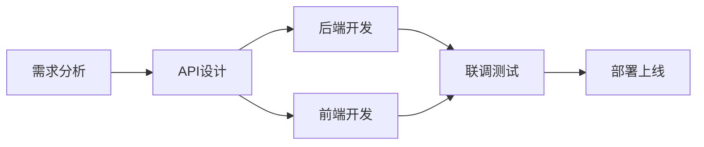

# 前端管理系统开发规划总结

> 企业微信群管理系统 - 前端开发项目概览  
> 文档日期：2025-10-27

---

## 📋 项目概述

基于现有后端系统（v5.0统一架构），开发一套完整的Web管理后台，为管理员提供可视化的操作界面。

### 核心目标

- 🎯 **可视化管理**：业务线、群组、规则、分销员的全生命周期管理
- 🔐 **安全可靠**：完善的认证授权体系，基于角色的权限控制
- 📊 **数据洞察**：丰富的数据分析和可视化图表
- 🚀 **高效易用**：现代化UI/UX设计，提升管理效率

---

## 📚 相关文档

### 主要文档

| 文档 | 说明 | 目标读者 |
|------|------|----------|
| [前端开发计划](./frontend_development_plan.md) | 完整的前端开发规划，包括技术选型、功能模块、开发阶段等 | 前端开发团队 |
| [后端鉴权实现](./backend_auth_implementation.md) | 后端API认证和权限控制实现指南 | 后端开发团队 |
| [系统架构设计](./architecture.md) | 后端系统整体架构文档 | 全体开发人员 |
| [数据库设计](./database_design.md) | 数据库表结构和关系设计 | 全体开发人员 |

### 后端现有文档

- `docs/unified_architecture_plan.md` - 统一架构实施计划
- `docs/V3.0功能实现完整性检查报告.md` - 功能实现状态

---

## 🎯 快速开始

### 后端开发人员

**第一步：实现API鉴权**（预计1-2天）

1. 阅读 [后端鉴权实现指南](./backend_auth_implementation.md)
2. 执行数据库迁移，创建管理员用户表
3. 实现认证API（/api/v1/auth/*）
4. 为现有API添加鉴权保护
5. 测试登录和权限验证流程

**关键产出**：
- ✅ POST /api/v1/auth/login
- ✅ GET /api/v1/auth/me
- ✅ 权限验证中间件
- ✅ 默认管理员账号

### 前端开发人员

**第一步：项目初始化**（预计1周）

1. 阅读 [前端开发计划](./frontend_development_plan.md)
2. 初始化Vue 3 + TypeScript项目
3. 配置开发环境和基础架构
4. 实现登录页面和认证流程
5. 搭建主布局和路由框架

**关键产出**：
- ✅ 可运行的项目框架
- ✅ 登录认证功能
- ✅ 基础组件库
- ✅ 开发规范文档

---

## 🏗️ 技术栈

### 前端技术栈

```
Vue 3.3+           # 前端框架
TypeScript 5.0+    # 类型系统
Vite 5.0+          # 构建工具
Element Plus 2.4+  # UI组件库
Pinia 2.1+         # 状态管理
Vue Router 4.2+    # 路由管理
Axios 1.6+         # HTTP客户端
ECharts 5.4+       # 数据可视化
```

### 后端技术栈（已有）

```
FastAPI 0.104+     # Web框架
SQLAlchemy 2.0+    # ORM
PostgreSQL 14+     # 数据库
Redis 7+           # 缓存
JWT                # 认证方案
```

---

## 📊 功能模块

### 核心功能（9大模块）

```
1️⃣ 仪表盘
   - 数据概览卡片
   - 趋势图表
   - 快捷操作

2️⃣ 业务线管理
   - 业务线列表
   - 创建/编辑业务线
   - 业务线统计

3️⃣ 群组管理
   - 群组列表
   - 群组详情
   - 成员管理
   - 数据同步

4️⃣ 加群规则管理
   - 规则列表
   - 创建/编辑规则
   - 群池配置
   - 企微配置管理

5️⃣ 短链接管理
   - 短链接列表
   - 创建短链接
   - 访问统计
   - 二维码生成

6️⃣ 分销员分析
   - 分销员列表
   - 效果分析
   - 对比分析
   - 排行榜

7️⃣ 数据同步
   - 手动同步
   - 状态监控
   - 同步历史

8️⃣ 学生认证管理
   - 学生档案
   - 认证记录
   - 标签管理

9️⃣ 系统设置
   - 用户管理
   - 权限配置
   - 系统日志
```

---

## 🔐 权限设计

### 用户角色

| 角色 | 权限范围 | 典型用户 |
|------|----------|----------|
| **super_admin** | 所有功能 | 系统管理员 |
| **business_admin** | 所属业务线的所有管理功能 | 业务线负责人 |
| **analyst** | 只读 + 数据分析 | 数据分析师 |
| **operator** | 规则配置 + 短链接管理 | 运营人员 |

### 权限示例

```typescript
// 超级管理员
permissions: ["*"]

// 业务线管理员
permissions: [
  "business_lines:view",
  "business_lines:update",
  "groups:*",
  "rules:*",
  "analytics:view"
]

// 分析员
permissions: [
  "business_lines:view",
  "groups:view",
  "rules:view",
  "analytics:*"
]

// 运营人员
permissions: [
  "business_lines:view",
  "groups:view",
  "rules:update",
  "short_urls:*"
]
```

---

## ⏱️ 开发计划

### 时间表（总计9-12周）

| 阶段 | 任务 | 周期 | 产出 |
|------|------|------|------|
| **阶段一** | 基础架构搭建 | 1-2周 | 项目框架、基础组件 |
| **阶段二** | 认证与权限 | 1周 | 登录功能、权限控制 |
| **阶段三** | 核心功能开发 | 3-4周 | 业务线、群组、规则管理 |
| **阶段四** | 数据分析 | 2周 | 分销员分析、图表组件 |
| **阶段五** | 系统管理 | 1周 | 用户管理、系统配置 |
| **阶段六** | 优化与测试 | 1-2周 | 性能优化、测试 |

### 里程碑

- ✅ **Week 2**: 基础架构 + 登录功能完成
- ✅ **Week 6**: 核心管理功能完成（业务线、群组、规则）
- ✅ **Week 8**: 数据分析功能完成
- ✅ **Week 9**: 系统管理功能完成
- ✅ **Week 11**: 测试和优化完成，可上线

---

## 🔄 开发流程

### 1. 前后端协作流程



### 2. 后端优先任务

**关键点**：前端开发依赖后端API鉴权，后端需优先完成

```
第1天：实现认证API
  ├─ 创建数据库表
  ├─ 实现 POST /api/v1/auth/login
  ├─ 实现 GET /api/v1/auth/me
  └─ 测试验证

第2-3天：为现有API添加鉴权
  ├─ 更新依赖注入
  ├─ 添加权限验证
  └─ 测试权限控制
```

### 3. 前端开发顺序

```
Week 1-2: 基础架构
  └─ 项目初始化 → 路由配置 → 布局组件 → 登录页面

Week 3-6: 核心功能
  └─ 仪表盘 → 业务线 → 群组 → 规则管理

Week 7-8: 数据分析
  └─ 分销员列表 → 详情分析 → 对比分析 → 图表优化

Week 9: 系统管理
  └─ 用户管理 → 权限配置 → 日志查看

Week 10-11: 优化测试
  └─ 性能优化 → 体验优化 → 功能测试 → 兼容性测试
```

---

## 🚀 部署方案

### 开发环境

```bash
# 前端
npm run dev              # http://localhost:5173

# 后端
uvicorn main:app --reload --port 18023
```

### 生产环境

```
Nginx（80/443）
  ├─ /              → 前端静态资源
  └─ /api/          → 后端API代理

Docker Compose:
  ├─ frontend       → Nginx + 静态文件
  ├─ backend        → FastAPI应用
  ├─ postgresql     → 数据库
  └─ redis          → 缓存
```

---

## 📝 开发规范

### Git提交规范

```bash
# 格式
<type>(<scope>): <subject>

# 示例
feat(auth): 实现登录功能
fix(groups): 修复群组列表分页bug
docs(readme): 更新项目说明
refactor(api): 重构API请求封装
```

### 代码规范

- **命名**：
  - 文件：kebab-case (`user-management.vue`)
  - 组件：PascalCase (`<UserManagement />`)
  - 函数/变量：camelCase (`getUserList`)
  - 常量：UPPER_SNAKE_CASE (`API_BASE_URL`)

- **TypeScript**：
  - 所有组件使用 TypeScript
  - 定义清晰的接口和类型
  - 避免使用 any

- **组件**：
  - 优先使用 Composition API
  - 组件拆分粒度适中
  - 复用性高的逻辑抽取为 composables

---

## 🔍 API接口清单

### 认证相关（需要实现）

| 方法 | 路径 | 说明 |
|------|------|------|
| POST | /api/v1/auth/login | 管理员登录 |
| POST | /api/v1/auth/logout | 登出 |
| GET | /api/v1/auth/me | 获取当前用户信息 |
| POST | /api/v1/auth/refresh | 刷新Token |

### 业务线管理（已有，需加鉴权）

| 方法 | 路径 | 说明 |
|------|------|------|
| GET | /api/v1/admin/business-lines/ | 获取业务线列表 |
| POST | /api/v1/admin/business-lines/ | 创建业务线 |
| GET | /api/v1/admin/business-lines/{id} | 获取业务线详情 |
| PUT | /api/v1/admin/business-lines/{id} | 更新业务线 |
| GET | /api/v1/admin/business-lines/{id}/groups | 获取业务线群组 |

### 群组管理（已有，需加鉴权）

| 方法 | 路径 | 说明 |
|------|------|------|
| GET | /api/v1/groups/ | 获取群组列表 |
| GET | /api/v1/groups/{chat_id} | 获取群组详情 |
| GET | /api/v1/groups/{chat_id}/members | 获取群组成员 |
| POST | /api/v1/groups/{chat_id}/sync | 同步群组信息 |

### 规则管理（已有，需加鉴权）

| 方法 | 路径 | 说明 |
|------|------|------|
| GET | /api/v1/join-rules | 获取规则列表 |
| POST | /api/v1/join-rules | 创建规则 |
| GET | /api/v1/join-rules/{id} | 获取规则详情 |
| PUT | /api/v1/join-rules/{id} | 更新规则 |
| DELETE | /api/v1/join-rules/{id} | 删除规则 |
| GET | /api/v1/join-rules/{id}/status | 获取规则状态 |

### 分销员分析（已有，需加鉴权）

| 方法 | 路径 | 说明 |
|------|------|------|
| GET | /api/v1/analytics/referrers/{referrer}/overview | 分销员概览 |
| GET | /api/v1/analytics/referrers/comparison | 对比分析 |
| GET | /api/v1/analytics/referrers/leaderboard | 排行榜 |

### 数据同步（已有，需加鉴权）

| 方法 | 路径 | 说明 |
|------|------|------|
| POST | /api/v1/admin/sync/data | 触发数据同步 |
| GET | /api/v1/admin/sync/status | 获取同步状态 |

---

## 🎨 UI设计参考

### 推荐配色方案

```scss
// 主色
$primary-color: #409EFF;     // 蓝色
$success-color: #67C23A;     // 绿色
$warning-color: #E6A23C;     // 橙色
$danger-color: #F56C6C;      // 红色
$info-color: #909399;        // 灰色

// 背景色
$bg-color: #F5F7FA;
$card-bg: #FFFFFF;

// 文字
$text-primary: #303133;
$text-regular: #606266;
$text-secondary: #909399;
```

### 布局参考

```
┌─────────────────────────────────────────────┐
│  Logo         [搜索框]    👤 Admin ▼       │  ← 顶栏
├─────┬───────────────────────────────────────┤
│     │                                       │
│ 📊  │  内容区域                              │
│ 🏢  │                                       │  ← 侧边栏 + 内容
│ 👥  │                                       │
│ 📝  │                                       │
│     │                                       │
└─────┴───────────────────────────────────────┘
```

---

## ⚠️ 注意事项

### 关键风险

1. **后端API鉴权未实现**
   - 🔴 风险：前端无法正常对接
   - ✅ 缓解：后端优先实现认证接口

2. **权限体系复杂**
   - 🔴 风险：开发周期延长
   - ✅ 缓解：先实现基础角色，后续迭代

3. **大数据量性能问题**
   - 🔴 风险：列表加载缓慢
   - ✅ 缓解：分页、虚拟滚动、懒加载

### 技术债务

- [ ] 完善单元测试（目标覆盖率 > 80%）
- [ ] 添加E2E测试
- [ ] 性能监控和分析
- [ ] 国际化支持

---

## 📞 联系方式

### 团队分工建议

| 角色 | 职责 | 人数 |
|------|------|------|
| **后端开发** | API鉴权、接口开发、数据库设计 | 1人 |
| **前端开发** | 页面开发、组件封装、状态管理 | 1-2人 |
| **UI设计** | 界面设计、交互设计（可选） | 0-1人 |

### 沟通机制

- 📅 **每日站会**：同步进度，解决阻塞
- 📝 **周报**：总结本周进展，规划下周任务
- 🐛 **Bug追踪**：使用Issue管理缺陷
- 📖 **文档更新**：及时更新技术文档

---

## ✅ 验收标准

### 功能验收

- [ ] 所有核心功能正常运行
- [ ] 权限控制正确实施
- [ ] 数据展示准确无误
- [ ] 表单验证完整

### 性能验收

- [ ] 首屏加载时间 < 2s
- [ ] 列表查询响应 < 500ms
- [ ] 支持1000+条数据流畅滚动

### 兼容性验收

- [ ] Chrome 90+
- [ ] Firefox 88+
- [ ] Edge 90+
- [ ] Safari 14+

### 安全验证

- [ ] Token安全存储
- [ ] API请求加密传输
- [ ] 敏感信息脱敏显示
- [ ] XSS/CSRF防护

---

## 📚 学习资源

### 前端技术

- [Vue 3 官方文档](https://vuejs.org/)
- [TypeScript 官方文档](https://www.typescriptlang.org/)
- [Element Plus 文档](https://element-plus.org/)
- [Pinia 文档](https://pinia.vuejs.org/)
- [ECharts 文档](https://echarts.apache.org/)

### 后端技术

- [FastAPI 官方文档](https://fastapi.tiangolo.com/)
- [SQLAlchemy 文档](https://docs.sqlalchemy.org/)
- [JWT 介绍](https://jwt.io/)

---

## 🎉 总结

这是一个**系统化、工程化**的前端项目规划，涵盖了从需求分析到部署上线的完整流程。

**关键成功因素**：

1. ✅ 后端优先实现API鉴权（阻塞项）
2. ✅ 前后端密切协作，API设计清晰
3. ✅ 遵循开发规范，代码质量可控
4. ✅ 合理安排开发顺序，及早发现问题
5. ✅ 重视测试和优化，确保用户体验

**预期成果**：

- 📱 一套功能完善的管理后台系统
- 🔐 安全可靠的权限控制体系
- 📊 丰富的数据分析和可视化
- 🎨 现代化的UI/UX体验
- 📚 完整的开发和部署文档

---

**文档版本**：v1.0  
**最后更新**：2025-10-27  
**维护者**：项目组

